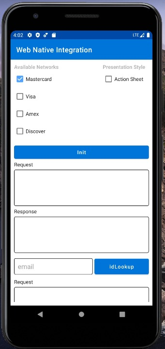
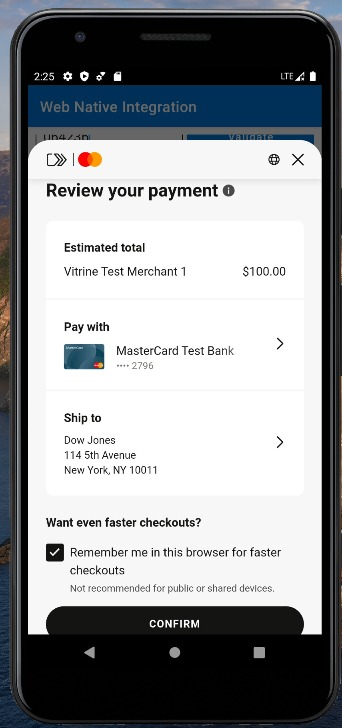
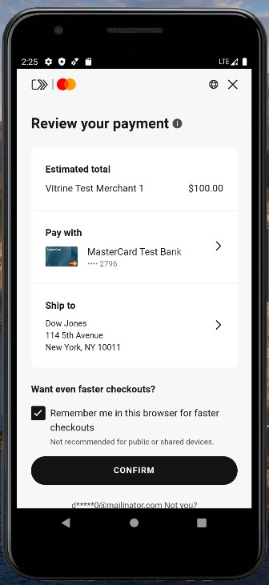

### Android integration of Web Javascript SDK.

Mastercard Javascript library provides Client-side APIs to complete Click-to-Pay checkout experience.
Merchant partners can use this Sample Merchant application as a guide to integrate Mastercard Javascript library with native mobile application.

### Table of Contents
- [Overview](#overview)
- [Steps to Integrate](#integration)
- [Communication between Native and Web layer](#communication)
- [Checkout Flows](#checkout)
- [DCF Action Sheet](#actionSheet)

### <a name="overview">Overview</a>
The sample app shows integration of Mastercard Javascript methods which can be used to perform Recognized User, Recognition of a User through Email lookup or First Time User Checkout flow. 
Integrators can test the different checkout flows from the sample Merchant screen as below:

  


### <a name="integration">Steps to Integrate</a>
1. Download Mastercard Javascript library by adding ````<script>```` tag on ````index.html```` 

```html
<script src="https://sandbox.src.mastercard.com/srci/merchant/2/lib.js?dpaId={DpaId}&locale=en_US"></script>
```
  
2. Add ````srcDpaId```` on ````initRequest.json````

This file is located under app/src/main/assets folder. 

<b>IMPORTANT:</b> Do not build the sample app without providing ````srcDpaId````. Failing to do so will block user from calling any Mastercard APIs.

````json
{
  "srcDpaId": "{}",
  "cardBrands": [
    "mastercard"
  ],
  "dpaTransactionOptions": {
    "dpaAcceptedBillingCountries": [],
    "dpaAcceptedShippingCountries": [],
    "dpaBillingPreference": "FULL",
    "dpaShippingPreference": "FULL",
    "dpaLocale": "en_US",
    "consumerNameRequested": true,
    "consumerEmailAddressRequested": true,
    "consumerPhoneNumberRequested": true,
    "threeDsPreference": "NONE",
    "paymentOptions": [
      {
        "dpaDynamicDataTtlMinutes": 15,
        "dynamicDataType": "CARD_APPLICATION_CRYPTOGRAM_SHORT_FORM"
      }
    ],
    "transactionAmount": {
      "transactionAmount": 100,
      "transactionCurrencyCode": "USD"
    }
  },
  "dpaData": {
    "dpaPresentationName": "Vitrine Test Merchant 1",
    "dpaName": "Vitrine Test Merchant 1"
  }
}
````  

### <a name="communication">Communication between Native and Web layer</a>
1. <b>Native to Web Layer: </b> API calls from native layer are invoked by calling the ````evaluateJavascript```` method on webView object. 

Merchant application converts the request object to JSON string before invoking Javascript APIs.

<b>Example: </b> init API called from WebViewIntegrationActivity.kt and API invocation completes on Javascript library.

````html
webView.evaluateJavascript("initSdk(\"android\", JSON.stringify($apiRequest))", null)
````

2. <b>API call inside Web layer: </b>

<b>Example: </b> init API being invoked on click2Pay object provided by Mastercard Javascript library.

````html
function initSdk(platform, apiRequest) {
	console.log('inside init:')
	console.log("init req: "+ apiRequest);

	let initRequest = JSON.parse(apiRequest);
  	let cardBrands = initRequest.cardBrands;
  	let srcDpaId = initRequest.srcDpaId;
  	let dpaTransactionOptions = initRequest.dpaTransactionOptions;
  	let dpaData = initRequest.dpaData;

  	const sampleInitParams = {srcDpaId, cardBrands, dpaTransactionOptions, dpaData};

	let promise = new Promise(
		function(resolve, reject) {
			click2payInstance.init(initRequest).then(resolve)
		});

	promise.then(
		value => {
			var formattedResponses = JSON.stringify(value, null, 2);
			console.groupCollapsed('Init API response:')
			console.log(formattedResponses)
			console.groupEnd();

			sendMessageToNative(platform, value, "init");
		},
		error => {
		sendMessageToNative(platform, error, "init");
		console.log('Init API rejected '+ error)
		});
}
````

3. <b>Web Layer to Native: </b> Once the API call is complete, the results are passed back to native layer from web layer using WebView.JavascriptInterface
More information on JavascriptInterface implementation can be found here: https://developer.android.com/guide/webapps/webview
   
Example: init API results being sent from javascript function back to Native Android activity. Results are received on JavascriptInterface on Android Activity.

````html
function sendMessageToNative(platform, json, methodName){
  var formattedJSON = JSON.stringify(json, 0, 2);
  switch(platform) {
    case "ios":
       window.webkit.messageHandlers.jsMessageHandler.postMessage(formattedJSON);
       break;
    case "android":
      JSBridge.showMessageInNative(formattedJSON, methodName);
      break;
  }
}
````

````kotlin
/**
   * Receive message from webview and pass on to native.
   */
  class JSBridge(val context: Context) {
    private val DOT = "."
    private val INTENT_API_RESPONSE = "API_RESPONSE"
    private val INTENT_API_NAME = "API_NAME"

    @JavascriptInterface
    fun showMessageInNative(
      message: String,
      method: String
    ) {
      var activity: WebViewIntegrationActivity = context as WebViewIntegrationActivity
      activity.runOnUiThread(Runnable {

        val intent = Intent(Intent.ACTION_MAIN)
        intent.component = ComponentName(
          activity.merchantContext, activity.merchantContext + DOT + activity.callingActivity
        )
        intent.putExtra(INTENT_API_RESPONSE, message)
        intent.putExtra(INTENT_API_NAME, method)
        intent.addFlags(Intent.FLAG_ACTIVITY_REORDER_TO_FRONT)
        activity.startActivity(intent)
      });
    }
  }
````
  

### <a name="checkout">Checkout Flows</a>
1. <b>New User Checkout</b> - To test this checkout flow call APIs in this order on Sample App: init, encryptCard, checkoutWithNewCard. Once checkout is initiated, this will launch DCF window and user can complete checkout.

2. <b>Return User Checkout (Unrecognized flow) </b> - To test this checkout flow call APIs in this order on Sample App: init, idLookup, initiateValidation, validate, getCards, checkoutWithCard

3. <b>Recognized User Checkout(Remembered User flow) </b> - To test this checkout flow either New user checkout or Return user checkout flow must be completed with "Remember Me" option selected during checkout experience. 
   Now the cookie is persisted on webView and user can test Recognized user flow by calling these APIs - init, getCards, checkoutWithCard  

### <a name="actionSheet">DCF Action sheet</a>  

Sample app provides optional styling of DCF window to be displayed as action sheet. This action sheet style mode can be enabled/disabled by selecting the checkbox located on top of the Merchant screen.  

   DCF Action Sheet Mode            |           DCF Regular Mode  
   :---------------------:          |        :---------------------:
    | 


